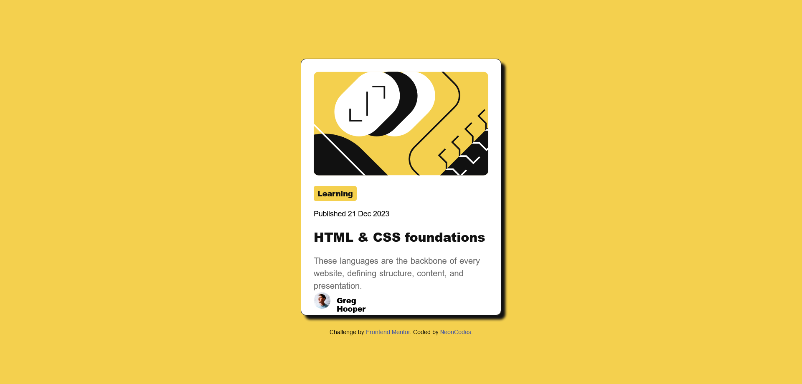

# Frontend Mentor - Blog preview card solution

This is a solution to the [Blog preview card challenge on Frontend Mentor](https://www.frontendmentor.io/challenges/blog-preview-card-ckPaj01IcS). Frontend Mentor challenges help you improve your coding skills by building realistic projects. 

## Table of contents

- [Overview](#overview)
  - [The challenge](#the-challenge)
  - [Screenshot](#screenshot)
  - [Links](#links)
- [My process](#my-process)
  - [Built with](#built-with)
  - [What I learned](#what-i-learned)
  - [Continued development](#continued-development)
  - [Useful resources](#useful-resources)
- [Author](#author)

## Overview

### The challenge

Users should be able to:

- See hover and focus states for all interactive elements on the page

### Screenshot

### Links

- Solution URL: [Add solution URL here](https://your-solution-url.com)
- Live Site URL: [Add live site URL here](https://your-live-site-url.com)

## My process

### Built with

- Semantic HTML5 markup
- Box model
- Flexbox

### What I learned
It was a good opportunity to continue practicing flexbox and try hover and focus states.

### Continued development
Next time, I hope I will code faster and make less research. Maybe try css grid.

### Useful resources

- [CSS Reset] (https://piccalil.li/blog/a-more-modern-css-reset/)
-[Box Model](https://web.dev/learn/css/box-model?continue=https%3A%2F%2Fweb.dev%2Flearn%2Fcss%23article-https%3A%2F%2Fweb.dev%2Flearn%2Fcss%2Fbox-model)
-[Image fill](https://developer.mozilla.org/en-US/docs/Learn/CSS/Howto/Fill_a_box_with_an_image)
-[Focus](https://web.dev/learn/css/focus?continue=https%3A%2F%2Fweb.dev%2Flearn%2Fcss%2F%23article-https%3A%2F%2Fweb.dev%2Flearn%2Fcss%2Ffocus)
-[more Focus](https://css-tricks.com/having-a-little-fun-with-custom-focus-styles/)
-[Box shadow](https://developer.mozilla.org/fr/docs/Web/CSS/box-shadow)

## Author

- Frontend Mentor - [@NeonCodes](https://www.frontendmentor.io/profile/NeonCodes)

